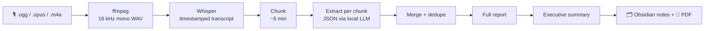

# crc_memo

[](https://github.com/pamobo0609/crc_memo/actions/workflows/tests.yml)


-lightgrey)


**Turn long, rambling voice memos into something you can act on — entirely on your Mac,
for $0, with first-class support for Costa Rican Spanish.**

Many people — especially older relatives and community members — report on meetings
through long, wandering WhatsApp voice notes. `crc_memo` transcribes the audio locally and
turns it into **meeting minutes**:

- **An executive summary** — one page: TL;DR, agreements, tasks (who / what / when), open
  questions, the next meeting, and anything the speaker asks *you* to do.
- **A full report** — organized by topic with timestamps, a task table, and a "tangents"
  section that tells you what was safe to skip.
- **Obsidian-ready notes** — every minuta lands in an Obsidian vault with properties, links
  to people and task checkboxes, so you can search and track meetings over time.
- **A PDF** of the short minuta to share back with the group.

> [!NOTE]
> **Work in progress.** Ingest and transcription work today; summarization is next.
> See [Status](#status).

---

## Why

| | |
|---|---|
| 🔒 **Private by design** | Audio, transcripts and reports never leave your machine. No accounts, no API keys, no telemetry. |
| 💸 **Free to run** | Open-source models (Whisper + a local LLM via Ollama). Zero cost is a [project rule](CONTRIBUTING.md#rules), not a tier. |
| 🇨🇷 **Speaks tico** | Ships a 12,909-entry Costa Rican Spanish dictionary so *brete*, *chunche* and *jalarse una torta* aren't lost in translation. |
| 🧩 **Built for long memos** | Small local models summarize poorly in one shot, so the pipeline chunks → extracts structured data → merges, instead of "summarize this transcript". |
| ⌨️ **CLI only** | One command. The only UI is the native macOS file picker. |

## How it works



The executive summary is written **from the full report, not the raw transcript** — each step
is small enough for a local model to do well. Memos are deduplicated by content hash, so
processing the same file twice is instant.

## Status

| Phase | What | |
|---|---|---|
| 0 | Setup, CLI skeleton | ✅ |
| 1 | Ingest: file picker, ffmpeg → WAV, dedupe by hash | ✅ |
| 2 | Transcription (mlx-whisper `large-v3-turbo`): a 27-min Spanish memo in ~1 min | ✅ |
| 3 | Summarization into meeting minutes (chunk → extract → merge → reports) | ⏳ in progress |
| 3.5 | Glossary checkpoint, judged by its effect on summaries | ⬜ |
| 4 | Output: Obsidian vault (properties, links, tasks) + PDF for the group | ⬜ |
| 5 | History & search — under review: Obsidian may cover it | ⬜ |

Full details and "done when" criteria: [docs/ROADMAP.md](docs/ROADMAP.md).

## Quick start

**Requirements:** macOS on Apple Silicon (Whisper runs via Apple's MLX), [Homebrew](https://brew.sh),
~12 GB free disk for models, 16 GB+ RAM recommended.

```sh
# 1. Tools
brew install ffmpeg uv ollama
brew services start ollama
ollama pull qwen3:14b            # default LLM; any Ollama model works (see Configuration)

# 2. Project
git clone https://github.com/pamobo0609/crc_memo.git
cd crc_memo
uv sync                          # creates .venv with Python 3.12 + dependencies

# 3. Run
uv run memo process ~/Downloads/nota-de-voz.ogg
uv run memo process              # no path → opens the macOS file picker
```

<details>
<summary>Why these tools?</summary>

- **[uv](https://docs.astral.sh/uv/)** — fast Python package/project manager. Pins exact
  versions in `uv.lock` and installs the right Python for you; `uv run` needs no venv activation.
- **[ffmpeg](https://ffmpeg.org/)** — converts any audio format to the 16 kHz mono WAV that
  Whisper models expect.
- **[Ollama](https://ollama.com/)** — runs open LLMs locally behind a simple HTTP API.
- **[mlx-whisper](https://github.com/ml-explore/mlx-examples/tree/main/whisper)** — Whisper on
  Apple Silicon's GPU via MLX (arrives in Phase 2).

</details>

## Commands

| Command | Does | |
|---|---|---|
| `memo process [PATH] [--lang es] [--sender NAME] [--date YYYY-MM-DD]` | Ingest, transcribe and write the minuta (`Minuta.md`). No path → file picker. Resumes where it stopped. The date is read from WhatsApp file names. | ✅ |
| `memo list` | Processed memos: date, title, duration, open action items | planned |
| `memo show ID [--exec\|--full\|--transcript]` | Print a memo's summary, report or transcript | planned |
| `memo reprocess ID [--from extract\|merge\|write\|render]` | Re-run summarization (after changing a prompt or model). Previous outputs are kept in the memo's `history/`. `--sender`/`--date` alone only re-render. | ✅ |
| `memo vault init PATH` | Create an empty vault (Spanish README, templates, git repo) — see below | ✅ |
| `memo publish ID [--no-push] [--force]` | Number the minuta (M12), write it + transcript + one note per commitment into your vault, commit and push | ✅ |
| `memo vault update [--no-push]` | Apply the name tables everywhere (never inside «quotes»), rebuild the short minutas, indexes and person pages, commit and push | ✅ |
| `memo vault check` | Check what people edit (minutas, commitment notes, name tables); problems as file:line | ✅ |

## Where your data lives

```
data/                        ← gitignored, never synced by this tool
└── memos/<id>/              ← <id> = first 12 chars of the file's SHA-256
    ├── original.ogg         ← untouched copy of what you processed
    ├── audio.wav            ← 16 kHz mono, what Whisper reads
    ├── transcript.txt       ← one [MM:SS] line per segment
    ├── segments.json        ← exact segment timestamps
    └── meta.json            ← original filename, language, transcription speed + loop warnings
```

## Your vault (bring your own)

Published minutas go to **your own vault**: a folder of plain Spanish markdown that is also a
git repo. Open it with [Obsidian](https://obsidian.md) (free) for its search — properties like
`[estado:abierto]`, tags — and it still reads well on GitHub. `memo vault init` sets
Obsidian to markdown links with relative paths, so links work in both. **This repo never contains a vault or any minuta**: it's public,
so `crc_memo` refuses a vault inside its own folder. Where your vault lives and who can see it
is up to you — a **private** GitHub repo (free) is what this project was built around.

```sh
uv run memo vault init ~/Documents/MinutasVault      # folders, README, templates, git init
# create a PRIVATE repo on GitHub, then:
git -C ~/Documents/MinutasVault remote add origin <url>
export CRC_MEMO_VAULT=~/Documents/MinutasVault       # e.g. in ~/.zshrc
uv run memo publish <memo id>                        # writes, commits and pushes
```

```
MinutasVault/
├── Propietarios.md                 ← one row per owner: lote, phone, email, name variants
├── Externos.md                     ← everyone else named in the audios (engineers, institutions…)
├── Minutas/2026/M12-2026-09-27/
│   ├── Minuta.md                   ← every item: code (M12-C3) + [mm:ss] «exact quote»
│   └── Transcripcion.md            ← the evidence every [mm:ss] points to
├── Compromisos/2026/M12-C3.md      ← one note per commitment: estado + seguimiento
├── Minutas/…/MinutaBreve.md         ← the short minuta for the group, derived from Minuta.md
├── Minutas/README.md, Compromisos/README.md   ← generated indexes (open commitments by person)
└── Personas/RosaPerez.md           ← generated page per person: contact, commitments, mentions
```

The audio never goes to the vault (only its SHA-256, so anyone can check which recording a
minuta came from). Correct a minuta by editing its `Minuta.md`; git history shows who changed
what. Names are fixed once: list how each person appears ("También dicen") in
`Propietarios.md` / `Externos.md` and run `memo vault update` — every minuta and commitment
gets the right name, while «quotes» stay exactly as said. Republishing keeps the number and refuses to overwrite a hand-edited minuta without
`--force`.

## Costa Rican Spanish

Most memos this tool is built for are in Costa Rican Spanish, so language support is
designed in from the start rather than bolted on (it lands across Phases 2–4):

- **Reports follow the memo's language** *(planned)* — a Spanish memo gets a Spanish
  summary, with consistent Spanish headings and dates (`5 oct 2026`).
- **Glossary** — [`crc_memo/glossary/dcaa.json`](crc_memo/glossary/dcaa.json) is an OCR import
  of Arturo Agüero Chaves' *Diccionario de costarriqueñismos*: 12,909 entries and 2,440
  phrases with meanings, usage tags (colloquial, vulgar, dated…) and variants. *(Planned:)*
  matching entries are given to the LLM per chunk, so *"me jalé una torta con el brete"*
  is summarized as *"cometí un error en el trabajo"* instead of being misread.
- **Slang normalization in reports** *(planned)* — *dos rojos* → ₡2.000; *ahorita* → no
  invented due date.

The dictionary reflects older and rural usage, so modern slang (*mae, birra, chante*) will get
a small hand-curated list. Its known limits are documented in
[`.claude/rules/glossary.md`](.claude/rules/glossary.md).

## Configuration

Settings live in [`crc_memo/config.py`](crc_memo/config.py):

| Setting | Default | Notes |
|---|---|---|
| `LLM_MODEL` | `qwen3:14b` | Any model you've pulled with Ollama |
| `LLM_NUM_CTX` | `16384` | Ollama's default context is small and **silently truncates** input |
| `WHISPER_MODEL` | `mlx-community/whisper-large-v3-turbo` | |
| `OUTPUT_DIR` | `~/Google Drive/Memos` | Where reports are written — becomes the Obsidian vault path in Phase 4 |
| `DATA_DIR` | `./data` | Local history, audio and transcripts |

## Development

```sh
uv run pytest        # runs the suite; fails below 100% line + branch coverage
```

- Tests are **fast and offline**: they convert real generated audio with ffmpeg, but never
  touch your `data/`, the network, Whisper or Ollama (those are faked).
- **CI** runs on `ubuntu-latest` via GitHub Actions — only when code changes; docs-only
  commits skip it.
- Read **[CONTRIBUTING.md](CONTRIBUTING.md)** before contributing: zero cost unless hard
  blocked, real memo data never enters the repo, every change ships with tests.

<details>
<summary>Project layout</summary>

```
crc_memo/
├── crc_memo/            # the app
│   ├── cli.py           # Typer commands
│   ├── config.py        # paths, models, settings
│   ├── ingest.py        # picker, hashing, ffmpeg
│   ├── prompts/         # LLM prompts as .md files (Phase 3)
│   └── glossary/        # Costa Rican Spanish dictionary
├── tests/
├── scripts/             # one-off tools (dictionary importer)
├── docs/ROADMAP.md
├── CONTRIBUTING.md      # repo rules
└── CLAUDE.md            # context for AI assistants
```

</details>

## Acknowledgements

- **Arturo Agüero Chaves** — *Diccionario de costarriqueñismos*, the source of the glossary.
- **OpenAI Whisper**, **Apple MLX**, **Ollama**, **Qwen** — the open models and runtimes this
  stands on.
- **[Scriberr](https://github.com/rishikanthc/Scriberr)** and
  **[Meetily](https://github.com/Zackriya-Solutions/meetily)** — prior art in local
  Whisper + LLM summarization.

## License

No license has been chosen yet, so all rights are reserved by default.
