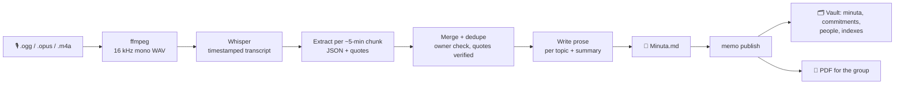

# crc_memo

[](https://github.com/pamobo0609/crc_memo/actions/workflows/tests.yml)


-lightgrey)


**Turn long, rambling voice memos into meeting minutes you can trace back to the audio —
entirely on your Mac, for $0, with first-class support for Costa Rican Spanish.**

Many people — especially older relatives and community spokespeople — report on meetings
through long, wandering WhatsApp voice notes sent to a group. `crc_memo` transcribes the audio
locally and turns it into a **minuta** (meeting minutes) that a person reviews before sharing:

- **`Minuta.md`** — the full minuta: summary, topics, agreements, commitments (who / what / by
  when), open questions, next meeting. Every item has a code you can say out loud (`M12-C3`)
  and the exact words with the minute they were said: `[03:45] «…»`.
- **`MinutaBreve.md` + `Minuta.pdf`** — the short version, as a large-print PDF to send back to
  the WhatsApp group. It highlights anything the speaker asks the group to do.
- **A vault** — a private git repo of Spanish markdown, readable on GitHub and in
  [Obsidian](https://obsidian.md): one note per commitment (status + follow-ups), a page per
  person, indexes of open commitments, and a git history of every correction.

> [!NOTE]
> The tool drafts, a person reviews. Local models make mistakes (a wrong owner, an invented
> open question); every claim carries its quote and timestamp so they're quick to spot and fix.

---

## Why

| | |
|---|---|
| 🔒 **Private by design** | Audio and working files never leave your machine. Only the minutas you publish go to *your* vault repo — never the audio. No accounts, no API keys, no telemetry. |
| 💸 **Free to run** | Open-source models (Whisper + a local LLM via Ollama). Zero cost is a [project rule](CONTRIBUTING.md#rules), not a tier. |
| 🔍 **Traceable** | Human IDs (`M12-C3`), quotes checked against the transcript in code, provenance (which audio, models, prompts and code version), git history of every fix. |
| 🇨🇷 **Speaks tico** | Money slang normalized (*cinco rojos* → ₡5.000), a 12,909-entry Costa Rican Spanish dictionary, Spanish output. |
| 🧩 **Built for long memos** | Small local models summarize poorly in one shot, so the pipeline chunks → extracts structured data → merges → checks → writes, one small step at a time. |
| ⌨️ **CLI only** | A handful of commands. The only UI is the native macOS file picker. |

## How it works



The summary is written from the per-topic notes, not the raw transcript, and the LLM only
writes prose — IDs, labels, dates, money and layout come from code, so they're consistent.

## Status

| Phase | What | |
|---|---|---|
| 0–2 | Setup, ingest (picker, ffmpeg, dedupe by hash), transcription (a 27-min memo in ~1 min) | ✅ |
| 3 | Minutas: extract → merge → write, `reprocess`, `--sender`/`--date` | ✅ tuning continues on more real memos |
| 3.5 | Glossary checkpoint, judged by its effect on minutas | ⬜ |
| 4 | Vault (publish, names, indexes, check) + PDF for the group | ✅ |
| 5 | History & search | ✅ resolved: Obsidian + the vault's indexes cover it |

Details and "done when" criteria: [docs/ROADMAP.md](docs/ROADMAP.md).

## Quick start

**Requirements:** macOS on Apple Silicon (Whisper runs via Apple's MLX), [Homebrew](https://brew.sh),
~12 GB free disk for models, 16 GB+ RAM recommended.

```sh
# 1. Tools
brew install ffmpeg uv ollama
brew services start ollama
ollama pull qwen3:14b            # default LLM; any Ollama model works (see Configuration)
brew install --cask obsidian     # optional, free: to read and search your vault

# 2. Project
git clone https://github.com/pamobo0609/crc_memo.git
cd crc_memo
uv sync                          # creates .venv with Python 3.12 + dependencies

# 3. Your first minuta
uv run memo process              # pick an audio file; ~15 min per 30 min of audio
```

All commands below run from the `crc_memo` folder as `uv run memo …`.

<details>
<summary>Why these tools?</summary>

- **[uv](https://docs.astral.sh/uv/)** — fast Python package/project manager. Pins exact
  versions in `uv.lock` and installs the right Python for you; `uv run` needs no venv activation.
- **[ffmpeg](https://ffmpeg.org/)** — converts any audio format to the 16 kHz mono WAV that
  Whisper models expect.
- **[Ollama](https://ollama.com/)** — runs open LLMs locally behind a simple HTTP API.
- **[mlx-whisper](https://github.com/ml-explore/mlx-examples/tree/main/whisper)** — Whisper on
  Apple Silicon's GPU via MLX.
- **[Typst](https://typst.app/)** (Python package) — builds the PDF; no LaTeX or browser.

</details>

## Tutorials

### 1. Turn an audio into a minuta — `memo process`

```sh
uv run memo process "WhatsApp Audio 2026-01-15 at 10.00.00.opus" --sender "Rosa Pérez"
uv run memo process                       # no path: opens the macOS file picker
```

1. **Ingest:** the file is copied into `data/memos/<id>/` (the id is the start of its SHA-256)
   and converted to WAV. The same file twice is recognized and skipped.
2. **Transcribe** with Whisper (about a minute for half an hour of audio; the first run
   downloads the model, ~1.6 GB). It warns about spots where Whisper may have looped.
3. **Extract, merge, write** with the local LLM — the slow part, about 15 minutes for 30
   minutes of audio. Each step prints how many tokens it read and wrote.
4. **Result:** `Minuta.md`, `MinutaBreve.md` and `Minuta.pdf` in the memo's folder, to preview
   before publishing.

Options:
- `--sender "Name"` — who recorded the audio; shown in the minuta, and owns the commitments
  the speaker makes ("se los mando yo").
- `--date YYYY-MM-DD` — the audio's date. Not needed for WhatsApp exports: it's read from file
  names like `WhatsApp Audio 2026-01-15 at …` or `PTT-20260115-WA0003`.
- `--lang es|en` — skip language detection (Whisper only listens to the first 30 seconds).

If it stops halfway (Ollama not running, Ctrl-C), run the same command again: it resumes
where it stopped. If the audio isn't a meeting recap (a complaint, an announcement) it says
so, and the minuta leaves out the meeting details instead of inventing them.

### 2. Redo part of it — `memo reprocess`

After changing a prompt, the model or a setting:

```sh
uv run memo reprocess a1b2                  # rerun everything after transcription
uv run memo reprocess a1b2 --from write     # only rewrite the prose
uv run memo reprocess a1b2 --sender "Rosa Pérez"   # just fix the header: no LLM calls
```

| `--from` | Reruns | LLM time |
|---|---|---|
| `extract` (default) | extract → merge → write → render | all of it |
| `merge` | merge → write → render | a few minutes |
| `write` | the prose (topics, summary) → render | a few minutes |
| `render` | `Minuta.md`, breve and PDF from what's there | none |

The memo id can be shortened to any unique start (`a1b2`). The previous outputs are copied to
the memo's `history/<date time>/` first, so you can compare before and after.

### 3. Create your vault — `memo vault init`

The vault is where published minutas live: a folder of Spanish markdown that is also a git
repo. **It is never part of this repo** (this repo is public; `crc_memo` refuses a vault inside
its own folder).

```sh
uv run memo vault init ~/Documents/MinutasVault
# On GitHub, create a PRIVATE repo (no README), then:
cd ~/Documents/MinutasVault
git remote add origin https://github.com/<you>/<your-vault>.git
git add -A && git commit -m "Inicio" && git push -u origin main
echo 'export CRC_MEMO_VAULT=~/Documents/MinutasVault' >> ~/.zshrc   # then open a new terminal
```

`init` creates a Spanish README (with a how-to for whoever maintains the vault), the name
tables, `Configuracion.md` and Obsidian settings for links that also work on GitHub. In
Obsidian, use *Open folder as vault*. Under *Settings → Files and links*, check that
"Use [[Wikilinks]]" is off and "New link format" is "Relative path to file".

### 4. Publish a minuta — `memo publish`

```sh
uv run memo publish a1b2
```

1. Gives the minuta the next number (`M12`; numbers are never reused) and its items codes
   (`M12-A1` agreements, `M12-C3` commitments, `M12-P1` open questions, `M12-O1` observations).
2. Writes `Minutas/<year>/M12-<date>/` — `Minuta.md`, `MinutaBreve.md`, `Transcripcion.md` and
   `Minuta.pdf` — plus one note per commitment in `Compromisos/<year>/`.
3. Rebuilds the indexes and person pages, commits **only the files it wrote**, and pushes.

`--no-push` keeps the commit local. Publishing the same audio again keeps its number, never
touches commitment notes (they hold follow-ups) and refuses to overwrite a minuta someone
edited — `--force` overrides that, regenerating the minuta and **discarding hand corrections**
to it, so it's only for redoing a minuta from scratch.

### 5. Fix a name everywhere — `memo vault update`

Whisper and the LLM write names however they heard them ("doña Rosita", "Rosa Peres"). Fix
them once:

1. In the vault, list each person with the forms they appear as («También dicen», separated
   by `;`): owners in `Propietarios.md` (one row per person, with lote, phone, email) and
   everyone else in `Externos.md`. For example
   `| Rosa Pérez | L-14 | … | | doña Rosa; Rosita | |`.
2. Commit those files (Obsidian's free Git plugin, or `git` in the terminal).
3. Run:
   ```sh
   uv run memo vault update
   ```
   It prints each fix (`Rosita → Rosa Pérez ×3`), applies it to every minuta, commitment note
   and short minuta — **never inside «quotes»**, which stay as said — rebuilds the PDFs, indexes
   and person pages, commits and pushes.

Files with uncommitted edits are skipped (and listed), so it never commits someone's work in
progress. To call the audio's recipients by the group's name instead of "Quienes reciben el
audio", set `destinatarios` in the vault's `Configuracion.md` and run `update`.

### 6. Correct a minuta and follow up commitments

Corrections are made by hand in the vault (Obsidian or any editor), then saved with git:

- **A wrong owner, a wrong sentence, an item that shouldn't be there:** edit the minuta's
  `Minuta.md`. Say why in the commit message, citing the minute:
  `M12-C3: responsable es Rosa Pérez («yo lo hago», 07:01)`. The minuta is the source of what
  was said: on `update`, a commitment you deleted loses its note (git keeps its history) and a
  changed owner, task or plazo is copied into its note.
- **A commitment's progress:** in `Compromisos/<year>/M12-C3.md`, add lines under
  «Seguimiento»; when it's done, set `estado: cumplido` (or `cancelado`) and `cerrado: <date>`.

Then run `uv run memo vault update`: the commitment notes, the short minuta, the PDF,
`Compromisos/README.md` (open commitments by person) and the person pages follow your changes.
A note's `estado`, `cerrado` and «Seguimiento» are never overwritten.

### 7. Check the vault — `memo vault check`

```sh
uv run memo vault check
```

Checks what people edit and lists problems as `file:line`: ✗ for errors (an `estado` that
isn't abierto/cumplido/cancelado, an invalid email or phone, a commitment without its note, a
duplicate number) and ⚠ for things worth a look (an owner not in the name tables, a closed
commitment without a date). It exits with an error code only for ✗.

### 8. Share with the group

Send `Minuta.pdf` from the minuta's folder in the vault (WhatsApp Desktop, or AirDrop it to
your phone). It's the short minuta in large print: the request to the group highlighted, no
timestamps or links. PDFs aren't committed — they're rebuilt from `Minuta.md` whenever you run
`publish` or `vault update`, so run `update` after correcting and before sending.

## Command reference

| Command | Does |
|---|---|
| `memo process [PATH] [--sender NAME] [--date YYYY-MM-DD] [--lang es]` | Audio → `Minuta.md`, breve and PDF in `data/memos/<id>/`. Resumes where it stopped. |
| `memo reprocess ID [--from extract\|merge\|write\|render] [--sender] [--date]` | Rerun from a step; previous outputs kept in `history/`. |
| `memo vault init PATH` | Create an empty vault (Spanish README, name tables, settings, git). |
| `memo publish ID [--no-push] [--force]` | Number it (M12) and write it into the vault; commit and push. |
| `memo vault update [--no-push]` | Apply the name tables everywhere; rebuild breves, PDFs, indexes and person pages; commit and push. |
| `memo vault check` | List problems in what people edit, as `file:line`. |

## Where your data lives

```
data/                              ← in this folder, gitignored: never leaves your Mac
└── memos/<id>/                    ← <id> = first 12 chars of the audio's SHA-256
    ├── original.opus, audio.wav   ← the audio (never published)
    ├── transcript.txt, segments.json
    ├── extractions.json, minutes.json, prose.json   ← each pipeline step
    ├── Minuta.md, MinutaBreve.md, Minuta.pdf        ← local preview
    ├── meta.json                  ← file name, sender, date, speeds, LLM stats, publish record
    └── history/                   ← previous outputs, one folder per reprocess

$CRC_MEMO_VAULT/                   ← your vault: a private repo you choose (Spanish)
├── README.md                      ← how to maintain it, in Spanish
├── Configuracion.md               ← e.g. destinatarios: the group's name
├── Propietarios.md, Externos.md   ← who's who + how the audios call them
├── Minutas/
│   ├── README.md                  ← generated index of minutas
│   └── 2026/M12-2026-01-15/
│       ├── Minuta.md              ← each item: code + [mm:ss] «quote»; ⚠ = quote not found
│       ├── MinutaBreve.md         ← generated from Minuta.md
│       ├── Minuta.pdf             ← generated, gitignored
│       └── Transcripcion.md       ← the evidence
├── Compromisos/
│   ├── README.md                  ← generated: open by person, closed by year
│   └── 2026/M12-C3.md             ← one note per commitment: estado + seguimiento
└── Personas/RosaPerez.md          ← generated: contact, commitments, mentions (Obsidian aliases)
```

The audio never goes to the vault — only its SHA-256, so anyone can check which recording a
minuta came from.

## Costa Rican Spanish

Most memos this tool is built for are in Costa Rican Spanish, so language support is designed
in rather than bolted on:

- **Output follows the memo's language**, with fixed Spanish/English labels and dates
  (`5 oct 2026`) from code. The vault is always Spanish.
- **Money slang is normalized in code**: *cinco rojos* → ₡5.000, *medio palo* → ₡500.000.
  Quotes stay as said.
- **Glossary** — [`crc_memo/glossary/dcaa.json`](crc_memo/glossary/dcaa.json) is an OCR import
  of Arturo Agüero Chaves' *Diccionario de costarriqueñismos*: 12,909 entries and 2,440
  phrases with meanings, usage tags and variants. *(Planned, Phase 3.5:)* matching entries
  given to the LLM per chunk, judged by whether they actually improve minutas.

The dictionary reflects older and rural usage — a good fit for elderly speakers; modern slang
(*mae, birra, chante*) will need a small hand-curated list. Its known limits are documented in
[`.claude/rules/glossary.md`](.claude/rules/glossary.md).

## Configuration

Settings live in [`crc_memo/config.py`](crc_memo/config.py); the vault's location comes from
the `CRC_MEMO_VAULT` environment variable (never from code — this repo is public).

| Setting | Default | Notes |
|---|---|---|
| `LLM_MODEL` | `qwen3:14b` | Any model you've pulled with Ollama |
| `LLM_NUM_CTX` | `16384` | Ollama's default context is small and **silently truncates** input |
| `WHISPER_MODEL` | `mlx-community/whisper-large-v3-turbo` | |
| `WHISPER_INITIAL_PROMPT` | a sentence with *ICE*, *monofásico*, *trifásico* | Words Whisper tends to mishear in your memos (public terms only). Set your own, or `None` |
| `CHUNK_SECONDS` | `300` | Transcript chunk sent to the LLM at a time |
| `LINE_SECONDS` | `10` | Whisper segments are packed into lines of about this long |
| `MIN_TOPIC_SECONDS`, `MIN_TANGENT_SECONDS` | `60`, `15` | Shorter topics are folded; shorter digressions aren't listed |
| `DATA_DIR` | `./data` | Audio, transcripts and working files (gitignored) |

## Development

```sh
uv run pytest        # runs the suite; fails below 100% line + branch coverage
uv run pytest -m integration --no-cov    # opt-in: real Whisper on synthetic audio (macOS)
```

- Tests are **fast and offline**: they convert real generated audio with ffmpeg and use real
  git and Typst, but never touch your `data/`, your vault, the network, Whisper or Ollama
  (those are faked). Test data is made up.
- **CI** runs on `ubuntu-latest` via GitHub Actions — only when code changes.
- Read **[CONTRIBUTING.md](CONTRIBUTING.md)** before contributing: zero cost unless hard
  blocked, real memo data never enters the repo, every change ships with tests.

<details>
<summary>Project layout</summary>

```
crc_memo/
├── crc_memo/            # the app
│   ├── cli.py           # Typer commands
│   ├── config.py        # paths, models, settings
│   ├── ingest.py        # picker, hashing, ffmpeg, meta.json
│   ├── transcribe.py    # Whisper, loop warnings
│   ├── summarize.py     # chunk → extract → merge (+ owner check, quotes) → write
│   ├── schemas.py       # LLM output shapes and the minutes.json contract
│   ├── output.py        # Minuta.md and MinutaBreve.md (es/en labels)
│   ├── pdf.py           # the group's PDF (Typst) + templates/minuta.typ
│   ├── vault.py         # publish, names, update, git
│   ├── views.py         # vault indexes, person pages, check
│   ├── prompts/         # LLM prompts as .md files
│   └── glossary/        # Costa Rican Spanish dictionary
├── tests/
├── scripts/             # one-off tools (dictionary importer)
├── docs/ROADMAP.md
├── CONTRIBUTING.md      # repo rules
└── CLAUDE.md            # context for AI assistants
```

</details>

## Acknowledgements

- **Arturo Agüero Chaves** — *Diccionario de costarriqueñismos*, the source of the glossary.
- **OpenAI Whisper**, **Apple MLX**, **Ollama**, **Qwen**, **Typst** — the open models and
  tools this stands on.
- **[Scriberr](https://github.com/rishikanthc/Scriberr)** and
  **[Meetily](https://github.com/Zackriya-Solutions/meetily)** — prior art in local
  Whisper + LLM summarization.

## License

No license has been chosen yet, so all rights are reserved by default.
